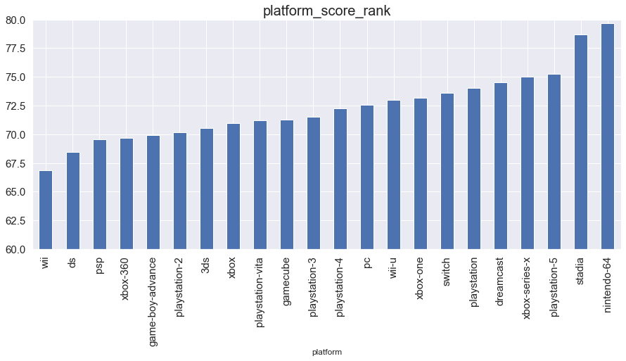

# Milestone 1 (Friday 8th April)

This is the report of milestone 1 in the course [Data visualization](https://edu.epfl.ch/coursebook/en/data-visualization-COM-480) of EPFL.

## Dataset

For this project, we decided to explore [Games of All Time from Metacritic](https://www.kaggle.com/datasets/xcherry/games-of-all-time-from-metacritic). It was found on [Kaggle](https://www.kaggle.com/)

### Data Quality

It contains 8831 different games from [metacritic](https://www.metacritic.com/browse/games/score/metascore/all/all/filtered), and offers us 9 attributes including **user score, meta score, platform information, description, developer, url to game, genre, rating (E, M, T etc), type (multi/single player)** of each game, so it is abundant to be explored. 

From a quick look, it provides data in good quality:
- **`Completeness`**: There is no missing data.
- **`Consistency`**: For each column, data inside is in the same type or format.
- **`Accuracy`**: User score and meta score are all in normal distribution.

### Data Prepossesing

The KEY reason that we selected this dataset is that we found the URL column inside the dataset, from which we could use web crawler to gather **Release Time** of each game! 

By using the time information, we can boost the information contained in the dataset a lot. For example, we can add time-axis on different dimensions, and depict the variation trend, which is very promising! 

Apart from release time, we can also gather other information like the comments from players, but it is not the main part.

Actually, we have collected time information by using Python Crawler, and the code is provided [here]

After colleting release time of each game, we can focus ourselves on data visualization in next two milestones!

## Problematic

### Overview

Through this project, we aim to provide a one-stop webpage with cool interaction that will deliver the interesting information of games evolving through time. 

### Motivation

Our motivation is to enable users to get insights to the dynamic information of game evolution in multiple dimensions at a single stop. The potential user types of our website can be:

- **`Players`**: By selecting rating(Game Target audients), type (multi/single player), genre, and etc, according to their personal preference, they will get some recommendations from our website. Or they just input a name of game(if applicable), and then they can be shown with abundant information related to the game that interests them.

- **`Game Companies`**: Game companies can get insight into the trend of game evolution, so in this case, they can move their targets to a specific direction respect to popular game genre, type and platform. Based on the information we provide, they can set the rules to hire people, like hiring software engineers with the knowledge of popular game platforms and types.

- **`Investors`**: Investors can view all positions or impact of different game companies, so they can make decision from their intuition of the market evolusion. As for the identifies of games, our platform can help investors adapt their attentions.

For all users, we can provide the relationship between user score and meta score, so they can have a better understanding of game scores in other platforms.

### Dimensions

The primary dimension of the visualization is as followings:
- **`Game Description`**: To outline a specific game, we will show the word cloud of this game by collecting information from different axis.
- **`Relationship Analysis`**: We will analyze the relationship between different attributes. For example, would platform affect the score of a game? How much it would affect?
- **`Popularity Analysis`**: We will show changing trend of popularity of game genres, platforms, rating, and developers.

## Exploratory Data Analysis

The pie chart shows the distribution of game types. It is apparent from the figures that action game is most popular among all games.

Regression of meta-score and user-score. All the points are located adjacent on either side of the regression line which shows a strong relation between meta-score and user-score.

The table shows a basic statistic of user score and meta score for each game including mean, standard deviation, quantile,etc.

Rank of different platforms. Nentindo-64 and stadia rank first and second, out perform than the other platforms.

Score distribution for platforms, from which we know most people prefer to grade platform between 70 and 85.

## Related Work(@zhiye.wang, collect some information about the practice happening on this dataset)
- **`Q1`**: What others have already done with the data?

Recommender System, like the [author](https://game-recommender-engine.herokuapp.com/) of this dataset. Besides, other people may perform Descriptive Analysis and Visualization and EDA-Exploratory Analysis.

- **`Q2`**: Why is your approach original?

We crawled the release date data of the games from orginal websites. The extra information is a good complementary to the original data so that we analyzed the data in a time series and drew some interesting and important fact.

- **`Q3`**: What source of inspiration do you take? Visualizations that you found on other websites or magazines (might be unrelated to your data).

We use pie chart, bar chart and line chart in our analysis. For each kind of the chart, the bar chart uses the height of the column to reflect the differences in data. The naked eye is very sensitive to height difference and the recognition effect is good. Line charts are suitable for large two-dimensional data sets, especially where trends are more important than individual data points. The pie chart shows the proportion of a certain part in the whole.

## The followings are templates!!!
The Pantheon data is clearly described in the author's paper: [Pantheon 1.0](https://arxiv.org/abs/1502.07310). Therefore, we scope our analysis on the columns that we plan to use in our visualization in the notebook [here](https://github.com/com-480-data-visualization/data-visualization-project-2021-famousworld/blob/main/notebooks/PantheonExploratory.ipynb).

### Spatial data analysis - birth and death locations

Each location is described by a tuple of floats, interpretable as the latitude and longitude in the [spherical coordinate system](https://en.wikipedia.org/wiki/Reference_ellipsoid#Coordinates). The birth and death locations are not available for 4.05%, and 56.78% of samples respectively. The death locations are missing as many people are still alive. Among the dead people, 9.74% do not have a death location. The dataset was prepared with a higher emphasis on birthplace completeness, therefore, we will scope on it as well in our visualization. From the analysis of the location, we observe that many of the persons are from Europe.

#### Birth Distribution

#### Death Distribution

### Temporal data analysis - birth and death date

The dataset provides two columns for both birth and death dates - "year" and "date". Since the date columns have more missing values, as such detailed information is often unknown for historical figures, we decided to use only "birth year" and "death year" columns. In total, 0.5% of birth years and 52.82% of death years are missing. Similar to death locations, 1.46% of dead people do not have a death date. Many entries are just rough approximations: in the BC era, 44.30% are the century years (divisible by 100), whereas it's the case only for 1.62% of AD samples.

### Categorical data analysis - occupation

The occupation information appears to be extracted from wikidata and not always perfectly fitting the biography. There are no missing values in the occupation data column. Each sample is associated with exactly one occupation. There are 101 distinct occupations. The most frequent one is "POLITICIAN" (15585 occurrences), and the least frequent - "BULLFIGHTER" (1 occurrence).

### Acquired supplementary data

Apart from the above-mentioned analysis, we have created a script to use HTTP requests to obtain images and a short bio of these persons from Wikipedia using Wikipedia API. The code for data filtering and enrichment is available [here](https://github.com/com-480-data-visualization/data-visualization-project-2021-famousworld/blob/main/src/process.py)

